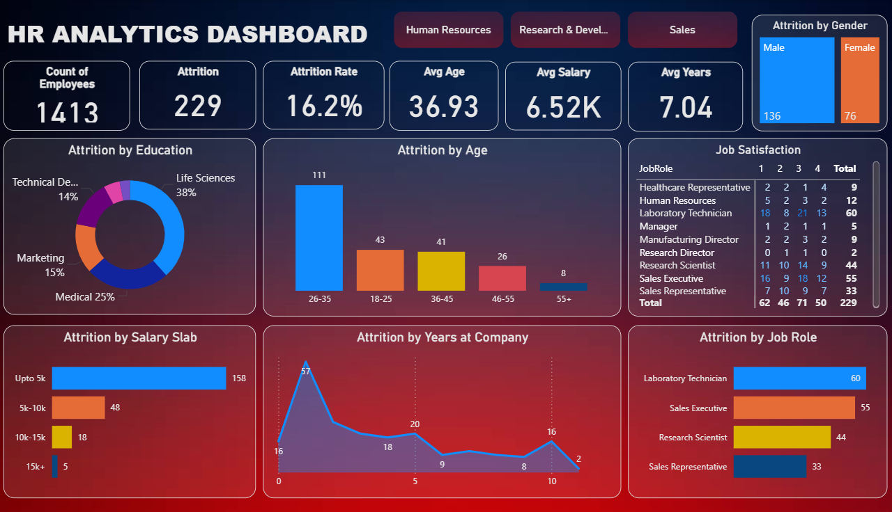
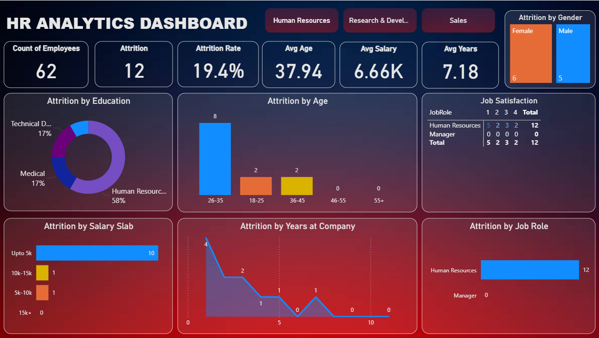
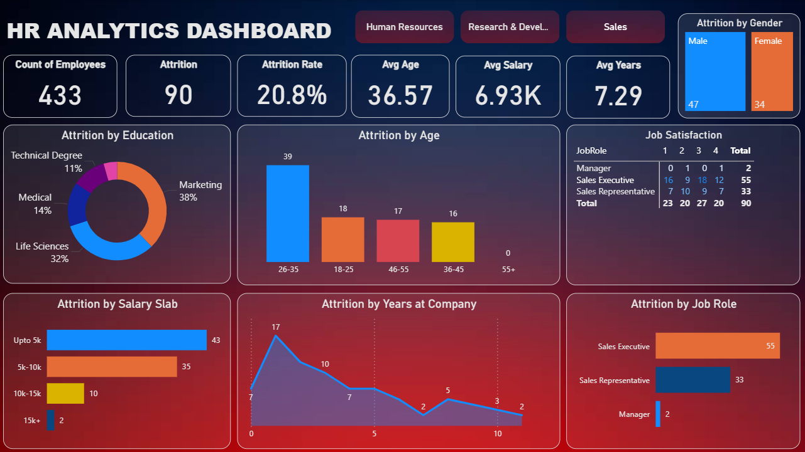

# 📊 HR Analytics Dashboard

## 📌 Project Overview
This project analyzes HR data to understand employee attrition trends and patterns based on education, years at the company, age, gender, job role, salary slab, and job satisfaction.  
It also allows filtering by departments (HR, R&D, Sales) using slicers.  
The goal is to help HR identify key attrition drivers and plan better retention strategies.

## 🛠 Tools Used
- [Microsoft Excel] – to store the dataset  
- [Power BI] – for data cleaning (Power Query) and creating the dashboard  
  *(Removed duplicates, nulls, and grouped data using built-in functions)*

## 📂 Folder Structure
hr-analytics-dashboard/
├─ powerbi/ -> Power BI (.pbix) file
├─ data/ -> Excel/CSV dataset
├─ images/ -> Dashboard screenshots

## 📸 Dashboard Preview
**Overview**

**By Department (Slicers)**
**HR**

**R&D**

**SALES**

## 📊 Key Insights
- Analyzed HR data to identify key attrition drivers, informing targeted retention strategies  
- Identified highest attrition rate of 16.2% among a workforce of 1413 employees  
- Pinpointed that Life Sciences professionals accounted for 38% of attrition  
- Determined lowest job satisfaction scores were among Research Directors and Sales Executives who left

## 📎 Dataset Source
Dummy data created for demonstration purposes.

## 👤 Author
**Omkar Sawant**  
[LinkedIn](https://www.linkedin.com/in/omkar-sawant-9118742ab/) • [GitHub](https://github.com/OmSawant98)

